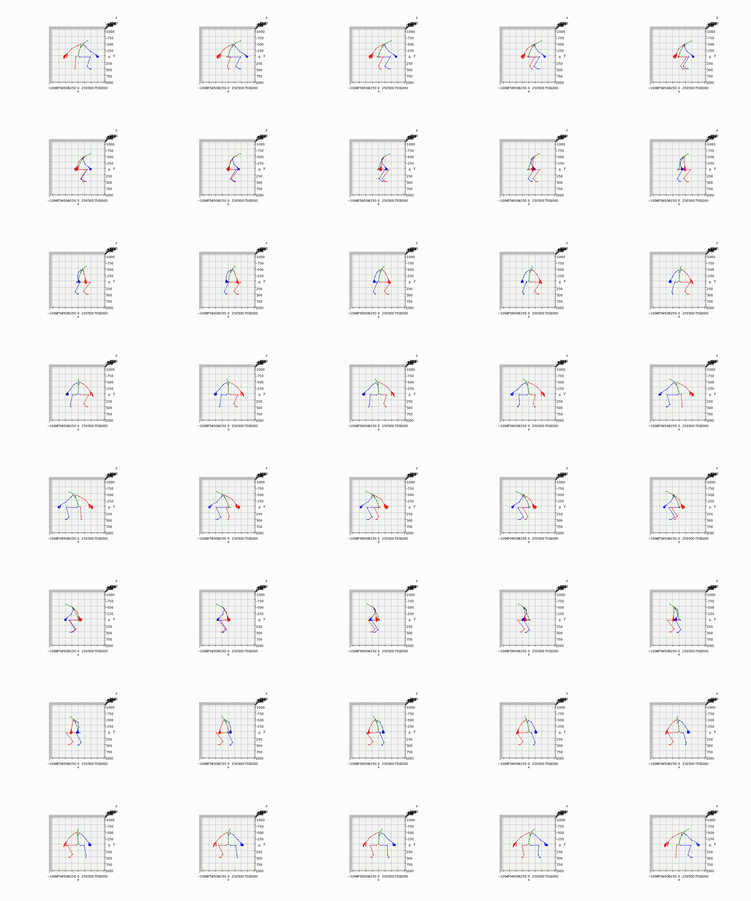

# fbx2kpts
generate 3d-2d keypoints pairs from fbx format file with blender

借助 blender, 从 fbx 骨骼文件生成 2d 和 3d 配对数据, 用以进行 3d pose estimation 的仿真数据生成

---
## 运行脚本
### step1:
  - 借助 blender，从 fbx 文件中解析出 3d 关键点
  - 执行 blender3 --background -P tools/kpts3d_gen.py
### step2: 
  - 借助 blender，通过指定虚拟视角，生成环绕的相机内外参
  - 执行 blender3 --background -P tools/cam_parm_gen.py
### step3: 
  - 通过仿真相机内外参，通过投影的方式，将 3d 关键点投影到 2d 平面
  - 执行 python3 tools/kpts_pairs_np_gen.py
###  step4: 
  - 生成 2d 和 3d 关键点的视频(optional)
  - 执行: python tools/kpts_pairs_video_gen.py
### step5: 
  - 生成最终的拼接效果图(optional)
  - 执行: python tools/vidoe_cat.py 

---
更多骨骼动画可以从 https://www.mixamo.com/ 下载
```
./data/fbx 中包含了两个骨骼动画
```

## 运行环境
---
需要安装 blender，并且将 blender 添加到系统执行目录以便可以在后台执行脚本, 在 mac 中配置 blender 的运行环境
```
打开终端应用程序
输入以下命令：vim ~/.bash_profile
在打开的文件中，添加以下行：export PATH="/Applications/Blender/blender.app/Contents/MacOS/blender:$PATH"
输入以下命令：source ~/.bash_profile

或者 
alias blenders='/Applications/Blender/blender.app/Contents/MacOS/blender'
```


requirements
```
fbx >= 3.4.1
matplotlib >= 3.5.1
numpy >= 1.23.4
```


---
## 最终效果图
视频结果见 ./video

##### 2d 关键点环绕视图


##### 3d 关键点环绕视图

